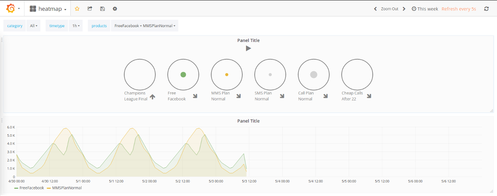
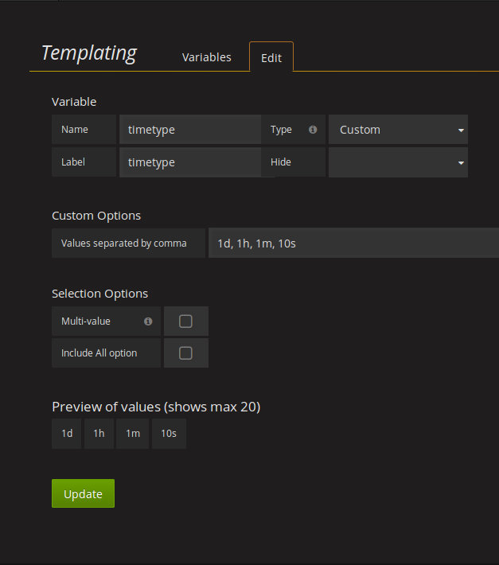
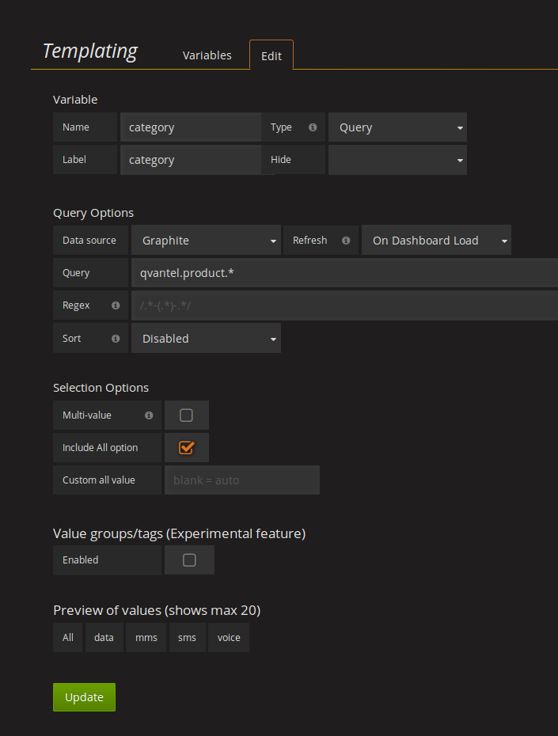

## HeatMap Dashboard for Grafana
**Dark theme:**


**Light theme:**


This dashboard visualizes available products. This is done by utilizing two different plugins, one which we have written ourselves, called heatmap panel, and also the [graph panel](http://docs.grafana.org/features/panels/graph/), which comes with Grafana.

The heatmap panel contains functionality to visualize the products and lapse through time to see how the products have changed.This is done by using the [D3](https://d3js.org/) JavaScript library to render each product. The product data is retrieved from a Graphite data source.

The graph plugin is used to show a timeline over how the popularity of selected products has evolved over time.

### How to use
When initiating the heatmap plugin into your dashboard, if the data source is selected you will see a representation of all available products. Each product is visualized by a filled white-circle surrounded by a gray outline, where the circle's size representing the current data and the outline representing the biggest value of the data in the timespan. Since the maximum value is based on what each product is currently showing, meaning that each entity is independent and isolated from other ones. This means that each product will be determined by using its own scale-range. The minimum value however, is always 0.

You can select or deselect products by clicking on a specific product. The selected product will be presented in the timeline graph showing the usage over time of each product. When a product is selected and is displayed on the graph, the product will be colored dynamically both in the graph plugin and the heatmap plugin. This helps the user to know what entities are are shown in the timeline graph when selecting products.

In the top left corner are two different menus located. The category menu is used to show only one category of products or all categories. The timetype menu is used to change how the values of the products is summarized over time. This will changes how many points that the timeline will have in the graph and how many steps the time-lapse will take. These menus are created with the help of templates, see [Templating](#templating) for more information.

#### Trends
Each product has an arrow beside the product name. This is representing the current trend of the product. The trend is calculated by using  [simple linear regression](https://en.wikipedia.org/wiki/Simple_linear_regression)

 The trend arrow has five different stages:<br>
 **Large up stream**: The trend is increasing by 50% or more.<br>
 **Small up stream**: The trend is increasing between 0,5% to 25%.<br>
 **Large down stream**: The trend is decreasing by 50% or more.<br>
 **Small down stream**: The trend is decreasing between 0,5% to 25%.<br>
 **Neutral**: Trend is going pretty much straight, spanning between +0,5% to -0,5%.

#### Time-lapse
Time-lapse is a tool built into the plugin. The tool provides functionality to watch how products have changed under a certain period of time. To start the time lapse, just click the play button at the top of the heatmap panel. This will use the time range in Grafana and go through it with steps stated in the timetype menu.

This tool provides different use case scenarios i.e. monitoring abnormal activities, see how products evolves and a fancy way to show off the system for potential customers.

### Templating
We are using templates as it provides a good way of sharing data between plugins. A template is a variable accessible by all the panels in a dashboard. For this dashboard, we're going to use three of them, which is called timetype, category and products.

* The product template saves the products that should be shown in the graph.
* The timetype template is used to change how much time a node should represent, right now we have it setup so it can be 10 seconds, 1 min, 1 hour or 1 day. This will change the timetype in both the heatmap and the graph.
* The category template is used to filter the different products. A specific category can be chosen, or all categories.

In order to setup the templates, first need to find the **cogwheel** in the top menu of the dashboard and choose **Templating**. Click the green **New** button and your ready to setup the templates. There are two different templates that will have to be setup. Timetype and category. There is also one more template called products, but it is made automatically in heatmap panel, all that has to be done to utilize products is to add it in the metrics.

#### Timetype
Add timetype as **Name** and **Label**, and input the **Type** custom. In **Custom Options** add the different times that can be used. In our case *1d,1h,1m,10s*.



#### Category
Add category as **Name** and **Label** and set **Type** to query. This will give reveal **Query Options**. Add the data source and point the query towards the placement of the categories in the data source. Also select Multi-value under the **Selection Options**.



### Metrics
To get the plugin working, a data source is required. This is done by setting up a data source. The data source is needed to fetch current values from available products to display each product a representative way.
The plugin does only support a Graphite data source, other data sources may need to be configured.

To setup a data source, take a look on the readme-file for the whole project:  [documentation](https://github.com/flygare/QvantelFrontend#data-source-setup).

#### Graphite query setup
When you have setup your Graphite data source, you'll need to go into the **Metrics** tab to alter the Graphite query. You'll need an admin account in order to see this tab.<br>

```
Our query for the heatmap:
summarize(qvantel.product.$category.*, '$timetype', 'sum', false)

Our query for the graph:
aliasByMetric(summarize(qvantel.product.$category.$products, '$timetype', 'sum', false))
```

#### Setting up the timeline graph
Follow the same instructions from the **Metrics** section to add the data source. Make sure to set use the right template variables in the right place and the graph will handle everything automatically.
